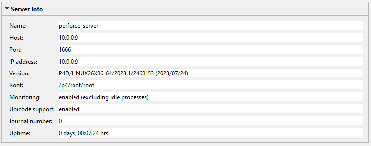

# Unity CI/CD Example

## Introduction

## CI/CD Infrastructure Setup

### Prerequisites

#### Installing Docker

There could be many reasons for this error. But most obvious reason for this error is using Windows Container in Linux Container Mode or vice versa.

Right-click Docker icon in the System Tray to open its context menu
Click "Switch to Windows/Linux Containers..."
Click the Switch button in the dialog (it may take little time)
Make sure Docker is in Running state now

#### Initialize a Docker Swarm

`docker swarm init`

`docker swarm join`

#### Configuring Environment Variables

### Perforce Server

#### Step 1: Deploy Docker Container

1. Open the directory `docker` in your shell.
2. Run the command: `docker stack deploy -c perforce-server/docker-compose.yml devops`

#### Step 2: Verify - Connect to the Server as Administrator

1. Start the program *P4Admin*.
2. Create a new connection:
   - *Server*: `localhost:1666` (if you run Perforce inside a local Docker container)
   - *User*: `admin` (the `P4USER` you specified in your `.env` file)
3. Click *Ok* and enter the password (`P4PASSWD`) you specified in your `.env` file.
4. Verify that the connection is successful, you should see the name `perforce-server` in the server info panel.



### Perforce Helix Swarm

#### Step 1: Deploy Docker Container

1. Open the directory `docker` in your shell.
2. Run the command: `docker stack deploy -c perforce-helix-swarm/docker-compose.yml devops`

#### Step 2: Match Swarm Hostname to IP (Optional)

1. Open the file `C:\Windows\System32\drivers\etc\hosts` on Windows with admin privileges.
2. Add the following line to the end of the file:

```
127.0.0.1 helix-swarm
```

#### Step 3: Change the Extension Port Configuration (Optional)

1. Run the following command in a shell:

```shell
p4 -p localhost:1666 -u super extension --configure Perforce::helix-swarm
```

2. Find the entry `Swarm-URL` in the text file that opened.
3. Change the entry's value from `http://helix-swarm/` to `http://helix-swarm:8085/` or to whatever port you used.
4. Save and close the text file.

### TeamCity Server

#### Step 1: Deploy Docker Container

1. Open the directory `docker` in your shell.
2. Run the command: `docker stack deploy -c teamcity-server/docker-compose.yml devops`

#### Step 2: Configure the TeamCity Server

1. Open `http://localhost:8111/` in your browser.
2. Click on the **Proceed** button if this is an initial setup.
3. Select the database type: `PostgreSQL`
4. Click **Download JDBC driver** and wait until the download is completed.
5. Set up the database connection by using the following parameters:
   - **Database host[:port]:** `teamcity-postgres`
   - **Database name:** the `POSTGRES_DB` environment variable, e.g., `teamcity`
   - **User name:** the `POSTGRES_USER` environment variable, e.g., `teamcity`
   - **Password:** the `POSTGRES_PASSWORD` environment variable
6. Click on **Proceed** and wait.
7. Accept the license agreement and click **Continue**.
8. Enter your admin user credentials and click **Create Account**.

You should now see the TeamCity dashboard.

#### Step 3: Install the Unity plugin

1. Open the *Administration* page.
2. Select *Plugins* from the side menu.
3. Click *Browse plugins repository* and hit *Proceed*.
4. Search for "Unity" and select the *Unity Support* plugin.
5. Click on *Get* and install the plugin to your local server.
6. Click on the *Install* button after being sent back to TeamCity.
7. After the plugin is installed, click *Enable uploaded plugin* and hit *Enable*.

#### Step 4: Change Maximum Build Artifact Size (Optional)

As an additional recommended step, open the adminstration panel and set the maximum build artifact file size to 1 GB or higher.

### TeamCity Build Agent

The final piece is the TeamCity build agent. This container also happens to be the most complex one as it requires a Docker multi-step build to combine the image for the TeamCity agent (`jetbrains/teamcity-agent`) with an image of a Unity editor installation (`unityci/editor`). Credits go to the guys of *GameCI* who maintain up-to-date images of Unity for all platforms.

More information on GameCI Docker images for Unity: https://game.ci/docs/docker/docker-images

#### Step 1: Build the Docker Container

The `Dockerfile` has already been prepared. However, as Unity requires a valid license to be provided, we need to prepare some additional credentials that shall be passed as *secrets*.

1. Open the folder `docker/teamcity-agent` in your shell.
2. Run the command `echo USER > secrets/unity_user.txt`, replace `USER` with your Unity account email.
3. Run the command `echo PASS > secrets/unity_pass.txt`, replace `PASS` with your Unity account password.
4. Run the command `echo SERIAL > secrets/unity_pass.txt`, replace `SERIAL` with your Unity serial key.
5. After the secret credentials have been provided, run the following command to build the image:

```shell
docker build -t teamcity-agent-unity \
	--secret id=unity_user,src=secrets/unity_user.txt \
	--secret id=unity_pass,src=secrets/unity_pass.txt \
	--secret id=unity_serial,src=secrets/unity_serial.txt \
	--progress=plain .
```

Run `docker images` to double-check if your new image named `teamcity-agent-unity` has been successfully built. An example output could look like this:

```
$ docker images
REPOSITORY                  TAG       IMAGE ID       CREATED         SIZE
teamcity-agent-unity        latest    5e5bd022315f   4 hours ago     9.39GB
jetbrains/teamcity-server   <none>    41fef15a96ff   12 days ago     2.23GB
perforce/helix-swarm        <none>    af4bc22cf11d   12 days ago     1.49GB
redis                       <none>    9c893be668ac   6 weeks ago     116MB
postgres                    <none>    f23dc7cd74bd   2 months ago    432MB
sourcegraph/helix-p4d       <none>    0bc3c79c2980   10 months ago   215MB
```

#### Step 2: Deploy the Docker Container

1. Open the directory `docker` in your shell.
2. Run the command: `docker stack deploy -c teamcity-agent/docker-compose.yml devops`

#### Step 3: Authorize the Agent

The following steps only need to be done once per agent:

1. Open the **Agents** page inside the TeamCity server UI.
2. Select the new agent `TCAgent1` from the pools on the side menu.
3. Click **Authorize...** and hit **Authorize** again.

## CI/CD Example Configuration

### Setting up a Project Depot on Perforce

#### Step 1: Create a New User

1. Open the tab *Users & Groups* in *P4Admin*.
2. Right-click on the users list and select *New User...*
3. Make sure to provide at least the following parameters: *User*, *Email*, *Full name*, *Password*.
4. Click *Ok* to create the new user.

#### Step 2: Submit Files to Depot

1. Start the program *P4V*.
2. Create a new connection:
   - *Server*: `localhost:1666` (if you run Perforce inside a local Docker container)
   - *User*: The user you created in the previous step.
3. Create a new workspace. Enter the user's password if requested.
4. Create a new Unity project or copy an existing one into the new workspace.
5. Copy the `p4ignore.txt` from the examples into the Unity project folder.
6. Open the *Workspace* view of *P4V*, right-click the root folder and select *Reconcile Offline Work...*
7. Wait until the popup shows up and then select *Reconcile*.

### Setting up a Project on TeamCity

#### Step 1: Prepare the Unity Project for TeamCity

In order to get the build configuration setup in TeamCity quick-started, it is recommended to prepare the configuration as source code inside the depot instead of doing a manual setup inside the UI. Alternatively, you can still use the TeamCity UI for convenience, but you should sync the configuration to your depot by default. TeamCity has an option for that. Copy the `.teamcity` folder from `examples/teamcity/unity-project-config` into the root folder of your workspace to provide a ready-made configuration for later use.

Additionally, we want to add a set of unit tests and a build script to the Unity project. We need those for the two build configurations we will create later on. You can skip this step if your project already has unit tests and a build script implemented. Otherwise, install the packages found at the following locations:

- `examples/unity/build-scripts/Pipeline.unitypackage`
- `examples/unity/tests/NUnitExample.unitypackage`

#### Step 2: Create the TeamCity Project and Build Configuration

1. Click on the *+* button next to *Projects*.
2. Specify the repository URL: `perforce://perforce:1666/depot`
3. Enter your Perforce username and password and click *Proceed*.
4. If your depot contains TeamCity configuration files, you will be asked if you want to import those. Select the option `Import settings from .teamcity/settings.kts and enable synchronization with the VCS repository` (recommended) or `Import settings from .teamcity/settings.kts`.
4. Set the project name and build configuration name and click *Proceed*.
5. If it auto-detects your build steps, select *Unity* from the list and click *Use selected*.

### Setting up a Project on Helix Swarm

1. Open Helix Swarm and select **Projects** from the side menu.
2. Click on **Add Project**.
3. Enter a project name and click **Create**.
4. Open the tab **Branches** from the project page that was opened.
5. Click on **Add new branch**.
6. Enter any name for the branch (e.g., `Main`) and the depot path (e.g., `//depot/...`).

### Setting up Tests on Helix Swarm

#### Prepare Tokens and IDs from TeamCity

1. Open your profile settings in TeamCity.
2. Open *Access Tokens* from the side menu.
3. Click on *Create access token*.
4. Set the *Token name* (e.g., `Helix_Swarm`) and click *Create*.
5. Copy the *Token value*, you will need it later.

#### Create a Test

1. Open Helix Swarm and select *Tests* from the side menu.
2. Click on *Add Test Definition*.
3. Choose a name for the test.
4. Use the following URL for the test: `http://teamcity:8111/app/perforce/runBuildForShelve`
   - Note that if your TeamCity server is on a different host, you need to change the URL accordingly.
5. Set the field *Timeout(seconds)* to 10 or any other appropriate value.
6. Copy the following string into *Body*: `buildTypeId=BUILDTYPE&vcsRootId=VCSROOTID&shelvedChangelist={change}&swarmUpdateUrl={update}`
   - Replace `BUILDTYPE` with the *Build Configuration ID* from TeamCity that is found inside the URL when selecting a build from a project. For example, `http://teamcity:8111/buildConfiguration/Tgdf2024_RunTests` refers to `Tgdf2024_RunTests`.
   - Replace `VCSROOTID` with the *VCS root ID* from TeamCity that is revealed when opening the editor page of the VCS root.
7. Add a header:
   - Set the name to `Authorization`.
   - Set the value to `Bearer TOKEN` and replace `TOKEN` with the TeamCity token you created for your user account.

More information: https://www.jetbrains.com/help/teamcity/integrating-with-helix-swarm.html

#### Create and Assign a Workflow

1. Open Helix Swarm and select *Workflows* from the side menu.
2. Click on *Add Workflow*.
3. Choose a name for the workflow.
4. Click *Add Test* and select the previously created test as definition. Then hit the green checkmark.
5. Finally, click *Save*.
6. Open the *Projects* page from the side menu and select your project.
7. Open the *Settings* page from the side menu.
8. Open the *General Settings* tab and assign the new workflow at the *Workflow* field of this project.

#### Setting up the Commit Status Publisher on TeamCity

Helix Swarm is now able to trigger test runs on TeamCity. Now we need a way for TeamCity to report back the test results to Helix Swarm.

1. Open the test runner build and select *Edit configuration...*
2. Open the page *Build Features* from the side menu.
3. Click *Add build feature* and choose `Commit status publisher`.
4. Pick the *VCS Root* and set *Publisher* to `Perforce Helix Swarm`.
5. Enter your Helix Swarm URL, e.g., `http://helix-swarm:8085/`
6. Enter the username of the Perforce user on whose behalf TeamCity will report, for example, `reviewer`.
7. Create a login ticket for this user by running the following command in your local shell: 
   - `p4 -p localhost:1666 -u reviewer login -a -p`
   - Copy the generated token and paste it to the *Ticket* field.
8. Enable *Code Review Comments*.
9. Click *Test connection* first and *Save* if everything works fine.

## CI/CD Example Usage

After going through the infrastructure deployment and the pipeline setup, it is finally time to see everything in action. This section describes an example workflow involving a developer and a reviewer.

1. The developer checks out some files into their changelist and makes changes.
2. The developer requests a new Swarm review of their changes from P4V.
3. A new review will be opened on Helix Swarm and a test run will be triggered on TeamCity.
4. The reviewer gets notified about the new review. They check the test result. In case the tests passed, they will perform the source code review and submit the changes if everything is alright.
5. With the change now being submitted to the depot, a new build will be triggered by TeamCity.
6. After the build is done, it can be downloaded from TeamCity and distributed to the testers.
